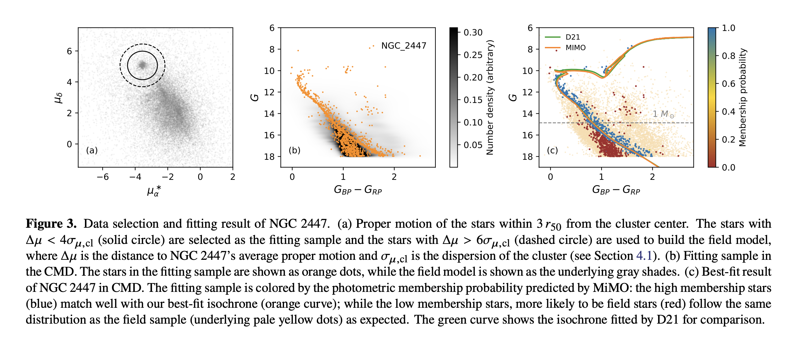
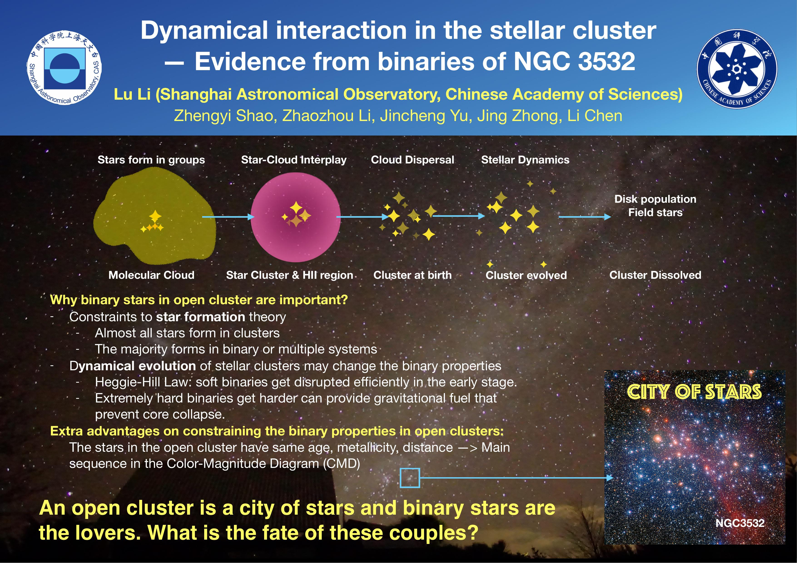
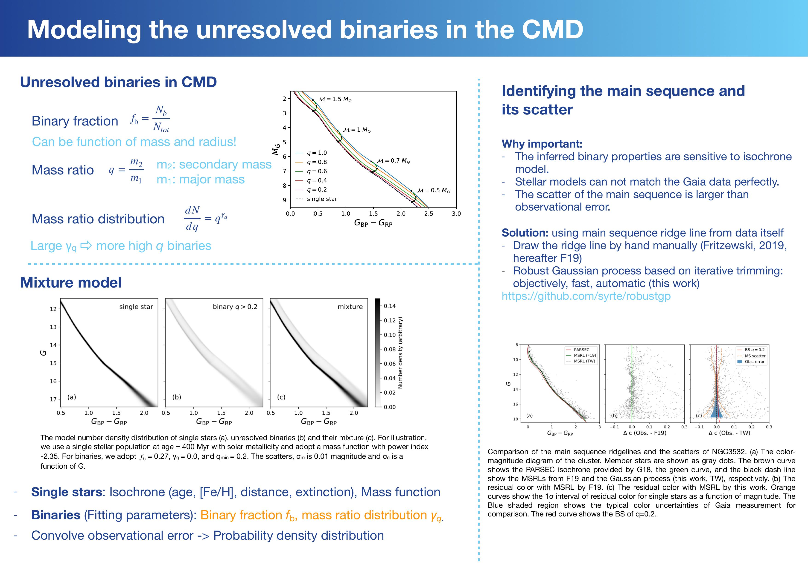
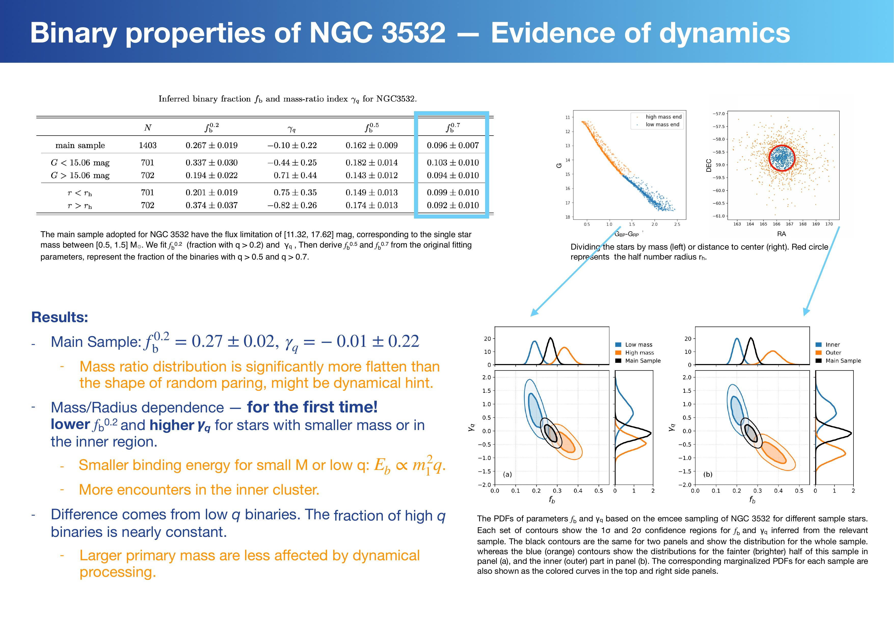
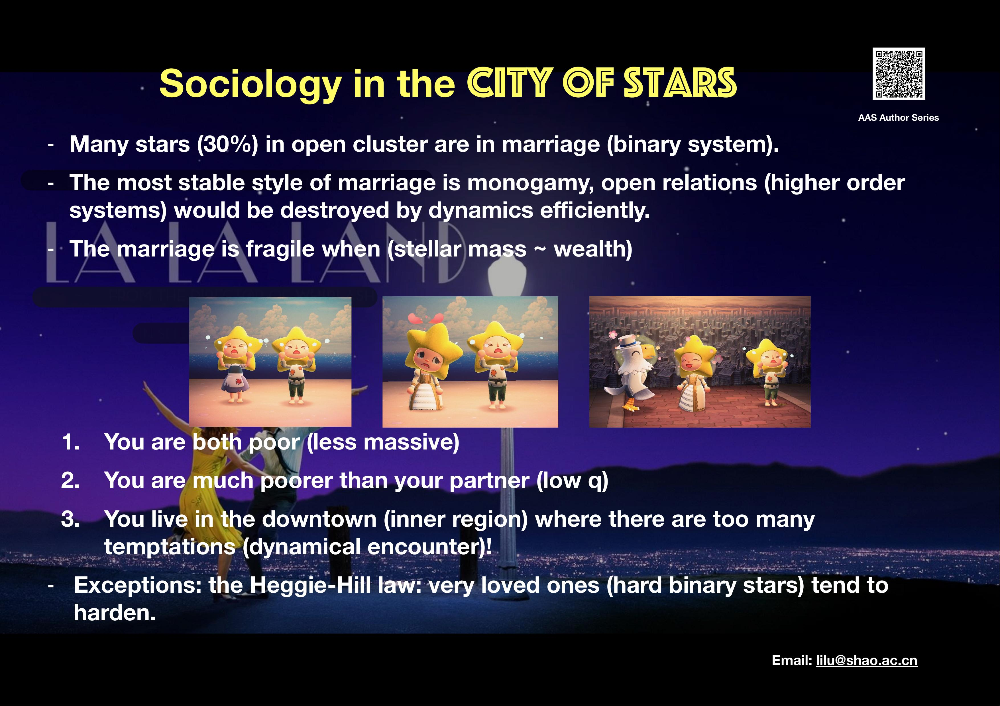
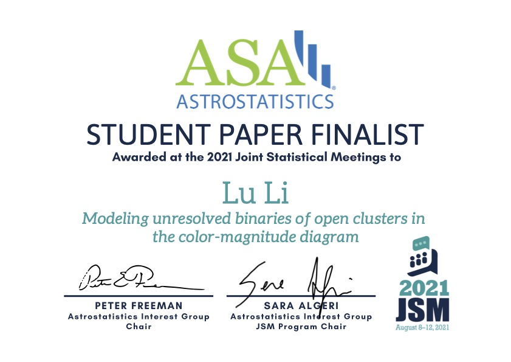

Publications: [**ADS**](https://ui.adsabs.harvard.edu/public-libraries/51HATpbMQnS7c7aTOCUzsQ)
Google Scholar:  [**Google Scholar**](https://scholar.google.com/citations?user=AYGrDKwAAAAJ)

## MiMO: Mixture Model for Open Clusters in Color Magnitude Diagram

As cradles of stars and building blocks of galaxies, open clusters encode valuable information about star formation and galaxy evolution. Hence, precisely and robustly measuring the fundamental properties of OCs, including age, metallicity, distance, extinction, stellar mass function (MF), and binary properties, is of great importance. The field star contamination has long been a major obstacle when determine the properties of open clusters. We established a state-of-the-art Bayesian framework that models the color-magnitude diagram of an observed OC as a mixture of single stars, photometric unresolved binaries, and field stars. Its advanced statistics and comprehensive physical models enable the determination of all the OC properties simultaneously with high precision.

## Dynamical interaction in the stellar cluster -- Evidence from binaries of NGC 3532

The binary properties of open clusters place crucial constraints on star formation theory and clusters’ dynamical evolution. We develop a comprehensive approach that models the color-magnitude diagram of the cluster members as the mixture of single stars and photometric unresolved binaries to measure the binary fraction and mass ratio distribution of open clusters. By applying our method to NGC 3532 with the Gaia DR2 photometry data, for the first time, we unveil that the stars with smaller mass or in the inner region tend to have lower f_b and more positive value of γ_q due to the lack of low mass-ratio binaries. The clear dependences of binary properties on mass and radius are most likely caused by the internal dynamics. 

This paper ([Link](https://ui.adsabs.harvard.edu/abs/2020ApJ...901...49L/abstract)) was selected by **AAS Journal Author Series** ([Link](https://youtu.be/y2m3ahIyY94)). And also selected as the finalist of **best student paper award** by American Statistical Society ([Link](https://astrostat.org/competition/results_2021.html)).

<!-- 

 -->

 

