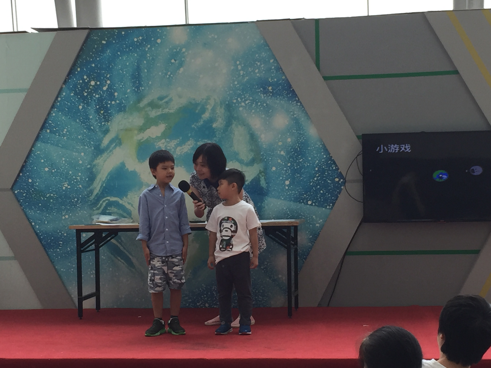

<!-- ### Popular Science -->

- Counselor for high school students in an official scientific practice project for youth (2016 -- 2020)
- Popular science courses *Explore the Astronomy -- Moon* (2018)
- Popular Science talk, *The planets in the solar system*, Shanghai Natural History Museum (2016)
- Volunteer guide at the Shanghai Natural History Museum (2016)
- Popular Science talk, *The Moon*, Shanghai Science & Technology Museum  (2016)
- Popular science courses for Huishi Primary School, 20 hours (2015 -- 2017)
- Popular science courses for Xuhui Middle School, 10 hours (2015 -- 2017)

<!--  -->

<!-- 

 
-->

